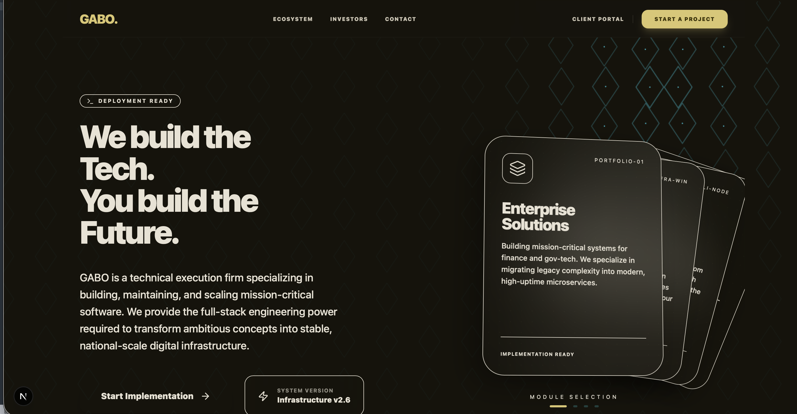

# GABO --- The Digital Engine for East Africa

**Gabo** is a high-performance technology firm based in Rwanda.\
We build the technical infrastructure --- spanning **Education, Real
Estate, and Sports** --- so our partners can focus on operations.

------------------------------------------------------------------------

## 🖼 Screenshots

### Home


## 🚀 Tech Stack

### Core
- **Framework:** Next.js (App Router)
- **UI Library:** React
- **Language:** TypeScript

### Styling
- **CSS Framework:** Tailwind CSS
- **PostCSS:** `@tailwindcss/postcss`

### Motion + UI
- **Animations:** Framer Motion
- **Icons:** Lucide React

### Tooling
- **Linting:** ESLint (Next.js config)
- **React Compiler:** Enabled (React Compiler / `reactCompiler: true`)

> Versions are defined in `package.json`.

------------------------------------------------------------------------

## 🛠 Getting Started

### Prerequisites

-   Node.js 18 or higher
-   MacBook Pro M4 recommended for local builds
-   Homebrew installed

------------------------------------------------------------------------

### Installation

Install dependencies:

``` bash
npm install
```

Run the development server:

``` bash
npm run dev
```

Open your browser and navigate to:

    http://localhost:3000

------------------------------------------------------------------------

## 📁 Project Structure

    /src/app        → Routes and page logic
    /src/component  → Reusable UI modules
    /src/lib        → Logic, utility functions, and types
    /assets         → Brand assets and 3D files

------------------------------------------------------------------------

## © Copyright

Copyright 2026 GABO TECHNOLOGY LTD.\
All Rights Reserved.
